## Campus Network Design
This project tries to create a sample network design for campus ( Done in 7th semester).

## Network Design Diagram

## Packet Tracer File
[See File](./Final_mini_project.pkt)

OR

Download Final_mini_project.pkt from this repository.

## Project Overview

This mini-project focuses on designing and implementing a campus network using Cisco Packet Tracer. The network is segmented into four areas, each with specific departmental blocks and services. The aim is to create a scalable, efficient, and well-organized network that supports various campus departments, ensures effective communication, and provides necessary services such as DNS, DHCP, and web hosting.

**Network Segmentation**

**Area 0: Backbone Network**

- Serves as the central backbone for the entire campus network, ensuring interconnectivity between all areas.

  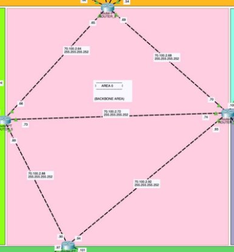

**Area 1: Civil Department and Blocks**

- Includes all blocks and departments related to civil engineering.

  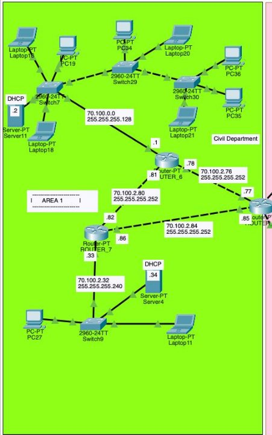

**Area 2: CIT and Library Building**

- Houses the CIT department and the library, providing critical services like DNS and web hosting.

  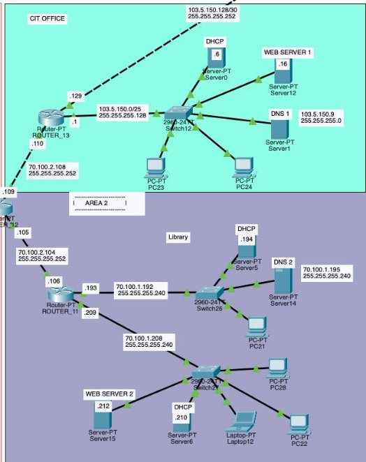

**Area 3: Chemistry Department and Boys Hostel**

- Contains the chemistry department and the boys' hostel, with VLANs implemented for effective network segmentation.

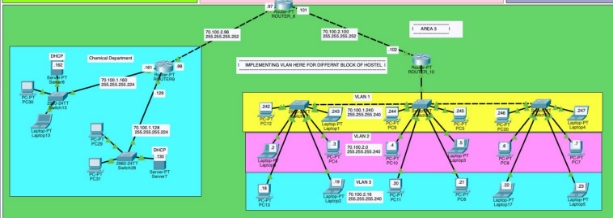

**Area 4: Computer & Electronic Department, Architecture Department, Electrical Department, and LOCUS 2025 Club**

- Includes multiple technical departments and the LOCUS 2025 club, emphasizing advanced networking features.

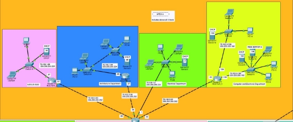

**Key Implementations**

**Pool of IP Addresses**

- Network Address: 70.100.0.0/16

**Number of Subnets with their Sizes**

|**Subnet ID**|**Subnet Mask**|**Network ID**|**Range**|**Usable IP Range**|**Number of Usable Hosts**|
| - | - | - | - | - | :-: |
|70\.100.0.0|255\.255.255.128|70\.100.0.0/25|70\.100.0.0 - 70.100.0.127|70\.100.0.1 - 70.100.0.126|126|
|70\.100.0.128|255\.255.255.192|70\.100.0.128/26|70\.100.0.128 - 70.100.0.191|70\.100.0.129 - 70.100.0.190|62|
|70\.100.0.192|255\.255.255.192|70\.100.0.192/26|70\.100.0.192 - 70.100.0.255|70\.100.0.193 - 70.100.0.254|62|
|70\.100.1.0|255\.255.255.224|70\.100.1.0/27|70\.100.1.0 - 70.100.1.31|70\.100.1.1 - 70.100.1.30|30|
|70\.100.1.32|255\.255.255.224|70\.100.1.32/27|70\.100.1.32 - 70.100.1.63|70\.100.1.33 - 70.100.1.62|30|
|70\.100.1.64|255\.255.255.224|70\.100.1.64/27|70\.100.1.64 - 70.100.1.95|70\.100.1.65 - 70.100.1.94|30|
|70\.100.1.96|255\.255.255.224|70\.100.1.96/27|70\.100.1.96 - 70.100.1.127|70\.100.1.97 - 70.100.1.126|30|
|70\.100.1.128|255\.255.255.224|70\.100.1.128/27|70\.100.1.128 - 70.100.1.159|70\.100.1.129 - 70.100.1.158|30|
|70\.100.1.160|255\.255.255.224|70\.100.1.160/27|70\.100.1.160 - 70.100.1.191|70\.100.1.161 - 70.100.1.190|30|
|70\.100.1.192|255\.255.255.240|70\.100.1.192/28|70\.100.1.192 - 70.100.1.207|70\.100.1.193 - 70.100.1.206|14|
|70\.100.1.208|255\.255.255.240|70\.100.1.208/28|70\.100.1.208 - 70.100.1.223|70\.100.1.209 - 70.100.1.222|14|
|70\.100.1.224|255\.255.255.240|70\.100.1.224/28|70\.100.1.224 - 70.100.1.239|70\.100.1.225 - 70.100.1.238|14|
|70\.100.1.240|255\.255.255.240|70\.100.1.240/28|70\.100.1.240 - 70.100.1.255|70\.100.1.241 - 70.100.1.254|14|
|70\.100.2.0|255\.255.255.240|70\.100.2.0/28|70\.100.2.0 - 70.100.2.15|70\.100.2.1 - 70.100.2.14|14|

|70\.100.2.16|255\.255.255.240|70\.100.2.16/28|70\.100.2.16 - 70.100.2.31|70\.100.2.17 - 70.100.2.30|14|
| - | - | - | :-: | :-: | - |
|70\.100.2.32|255\.255.255.240|70\.100.2.32/28|70\.100.2.32 - 70.100.2.47|70\.100.2.33 - 70.100.2.46|14|

**Small Subnets for point-to-point connection between Routers**

|**Subnet ID**|**Subnet Mask**|**Network ID**|**Range**|**Usable IP Range**|**Number of Usable Hosts**|
| - | - | - | - | :-: | :-: |
|70\.100.2.48|255\.255.255.252|70\.100.2.48/30|70\.100.2.48 - 70.100.2.51|70\.100.2.49 - 70.100.2.50|2|
|70\.100.2.52|255\.255.255.252|70\.100.2.52/30|70\.100.2.52 - 70.100.2.55|70\.100.2.53 - 70.100.2.54|2|
|70\.100.2.56|255\.255.255.252|70\.100.2.56/30|70\.100.2.56 - 70.100.2.59|70\.100.2.57 - 70.100.2.58|2|
|70\.100.2.60|255\.255.255.252|70\.100.2.60/30|70\.100.2.60 - 70.100.2.63|70\.100.2.61 - 70.100.2.62|2|
|70\.100.2.64|255\.255.255.252|70\.100.2.64/30|70\.100.2.64 - 70.100.2.67|70\.100.2.65 - 70.100.2.66|2|
|70\.100.2.68|255\.255.255.252|70\.100.2.68/30|70\.100.2.68 - 70.100.2.71|70\.100.2.69 - 70.100.2.70|2|
|70\.100.2.72|255\.255.255.252|70\.100.2.72/30|70\.100.2.72 - 70.100.2.75|70\.100.2.73 - 70.100.2.74|2|
|70\.100.2.76|255\.255.255.252|70\.100.2.76/30|70\.100.2.76 - 70.100.2.79|70\.100.2.77 - 70.100.2.78|2|
|70\.100.2.80|255\.255.255.252|70\.100.2.80/30|70\.100.2.80 - 70.100.2.83|70\.100.2.81 - 70.100.2.82|2|
|70\.100.2.84|255\.255.255.252|70\.100.2.84/30|70\.100.2.84 - 70.100.2.87|70\.100.2.85 - 70.100.2.86|2|
|70\.100.2.88|255\.255.255.252|70\.100.2.88/30|70\.100.2.88 - 70.100.2.91|70\.100.2.89 - 70.100.2.90|2|
|70\.100.2.92|255\.255.255.252|70\.100.2.92/30|70\.100.2.92 - 70.100.2.95|70\.100.2.93 - 70.100.2.94|2|
|70\.100.2.96|255\.255.255.252|70\.100.2.96/30|70\.100.2.96 - 70.100.2.99|70\.100.2.97 - 70.100.2.98|2|

|70\.100.2.100|255\.255.255.252|70\.100.2.100/30|70\.100.2.100 - 70.100.2.103|70\.100.2.101 - 70.100.2.102|2|
| - | - | - | :-: | :-: | - |
|70\.100.2.104|255\.255.255.252|70\.100.2.104/30|70\.100.2.104 - 70.100.2.107|70\.100.2.105 - 70.100.2.106|2|
|70\.100.2.108|255\.255.255.252|70\.100.2.108/30|70\.100.2.108 - 70.100.2.111|70\.100.2.109 - 70.100.2.110|2|

**IP Address of Each Server**

|Name|Address|
| - | - |
|WEB SERVER 1 (cit.pcampus)|103\.5.150.16|
|WEB SERVER 2 (library.pcampus)|70\.100.1.212|
|WEB SERVER 3 (doece.pcampus)|70\.100.0.196|
|DNS 1 (inside cit)|103\.5.150.9|
|DNS 2 (inside library)|70\.100.1.195|
|DNS Resolver ( inside ISP )|139\.5.70.2|

**Public Address Assignment**

- **CIT Department:** Uses the public address range 103.5.150.0/24 for communication between the external world and campus network. This public address is also used by different servers of CIT such as DNS server web server etc. This network has been divided into 2 networks as 103.5.150.0/25 for CIT servers and computers and 103.5.150.128/30 for point-to-point communication between CIT default router and ISP router.
- **Point-to-Point Connection:** A public address is assigned for the connection between the CIT router (default gateway) and the ISP router.

  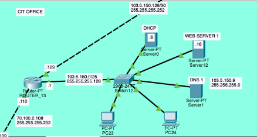

All use of public ip addresses has been summarized in the table below.

|**Subnet ID**|**Subnet Mask**|**Network ID**|**Range**|**Usable IP Range**|**Hosts**|
| - | - | - | - | - | - |
|103\.5.150.0|255\.255.255.128|103\.5.150.0|103\.5.150.0 - 103.5.150.127|103\.5.150.1 - 103.5.150.126|126|
|103\.5.150.128|255\.255.255.252|103\.5.150.128|103\.5.150.128 - 103.5.150.131|103\.5.150.129 - 103.5.150.130|2|
|139\.5.70.0|255\.255.0.0|139\.5.0.0|139\.5.0.0 - 139.5.255.255|139\.5.0.1 - 139.5.255.254|65534|

**VLAN Implementation**

- **Area 3: Boys Hostel:**
  - **VLAN 1:** Top floor of each block (A, B, C).
  - **VLAN 2:** Middle floor of each block.
  - **VLAN 3:** Bottom floor of each block.
- **Visualization:** Different colored boxes represent various VLANs with appropriate addresses and subnet labels.

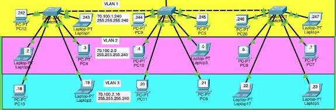

**Web Servers**

- **Locations:** Three web servers are hosted in the CIT building, library, and Computer & Electronic department.
- **Websites:** Each server hosts a departmental website with URLs like doece.pcampus, cit.pcampus, library.pcampus, etc. We also have a ISP’s server worldlink.com
- **Content:** Each website displays a welcome message specific to the respective department.

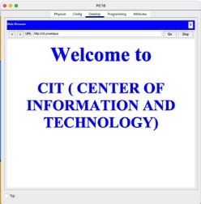 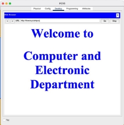

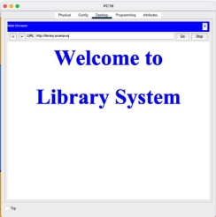 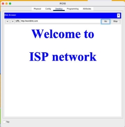

**DNS Forwarding**

- **DNS Servers:** Two DNS servers are located in the CIT office and library for caching and forwarding.
- **Implementation:** NS records are used to forward DNS requests from the CIT DNS server to the library DNS server. ISP website requests are also forwarded appropriately.

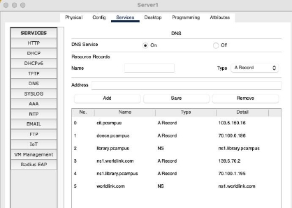

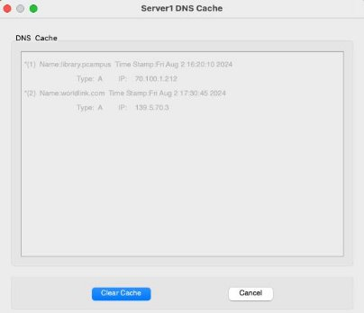

In DNS 2 kept in library:

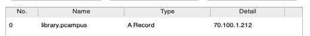

In DNS of ISP:

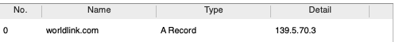

**DHCP Implementation**

- **DHCP Servers:** Nearly all networks have DHCP servers with static IP assignments for connected devices.

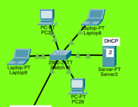

- **VLANs in Boys Hostel:** Static IP assignment is used due to the complexity of DHCP configuration in VLANs.

**ISP Configuration**

- **Public Network:** ISP is assigned the public network 139.5.70.0/16, containing a web server and a DNS server.
- **Routing Protocol:** Rather than using BGP, static routing has been used for now between the CIT default gateway router and the ISP router.
- **Ping Tests:** Successful pings to unknown sites result in "destination host unreachable" messages, indicating proper back routing implementation.

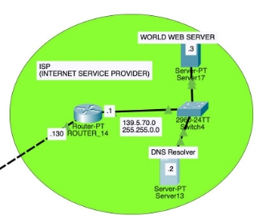

**Limitations and Future Enhancements**

- **Campus Expansion:** Adding more blocks and calculating the number of users in each department accurately.
- **NAT Implementation:** Using NAT in the CIT office to forward packets to the ISP.
- **Advanced DNS Forwarding:** Implementing deeper DNS forwarding with multiple nameservers and tracking websites from root to authoritative DNS servers.
- **Enhanced Routing:** Utilizing more routers for multipath and stronger communication.
- **BGP Protocol:** Implementing BGP for inter-AS communication.

**Conclusion:**

This mini-project successfully demonstrates the design and implementation of a comprehensive campus network using Cisco Packet Tracer. By effectively segmenting the network into distinct areas, implementing VLANs for efficient traffic management, deploying critical services such as DNS and DHCP, and ensuring robust connectivity with an ISP, the project meets all specified requirements. Advanced configurations, such as DNS forwarding, public address assignment, and inter-VLAN communication, highlight the project's sophistication. This network design not only facilitates seamless communication and resource sharing across various departments but also provides a scalable foundation for future enhancements and expansions.

**Packet Tracer File**

**For Packet Tracer File, refer to below link: 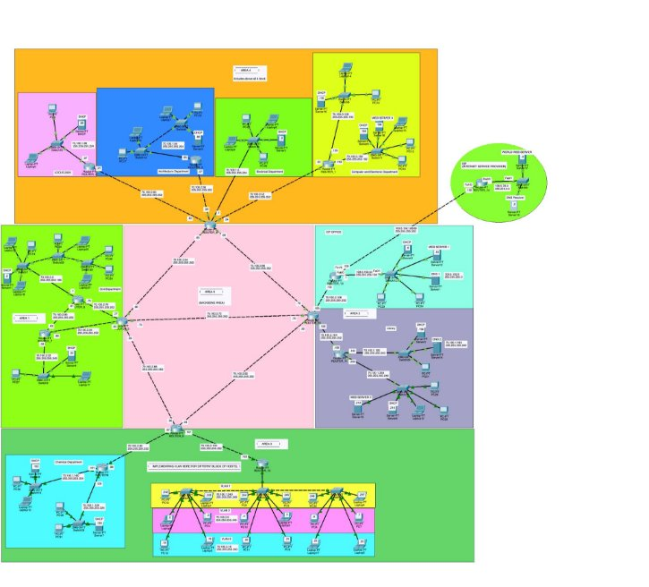**

**Fig: Packet Tracer Diagram of Campus Network**

---

[Download Pdf](https://github.com/user-attachments/files/17410650/Details_of_Project.pdf)

